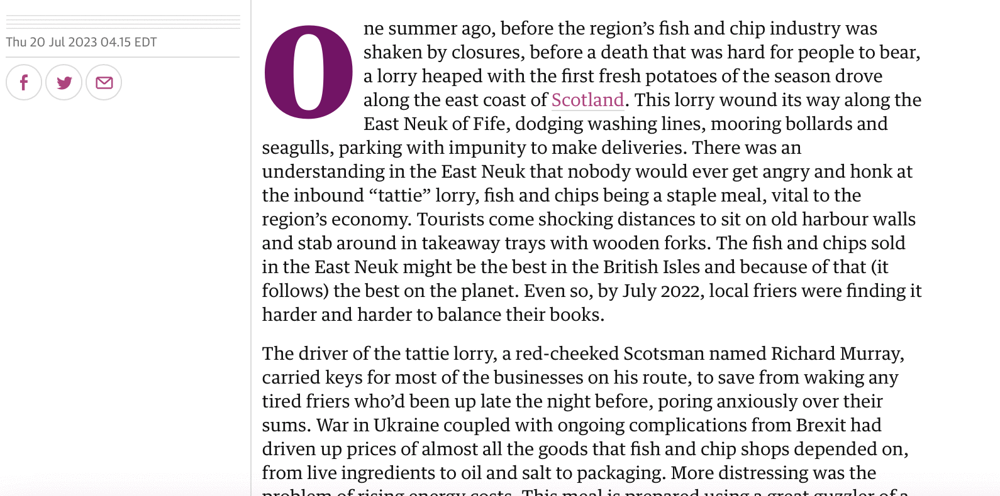

# guardian-breaks

[The Guardian website](https://www.theguardian.com) used to have pleasant, generous line spacing. Now (since roughly 31 July 2023) they have unpleasant, tight line spacing.

This is a user script (for Greasemonkey, Tampermonkey, Userscripts, etc.) that restores the old, nice line spacing.

